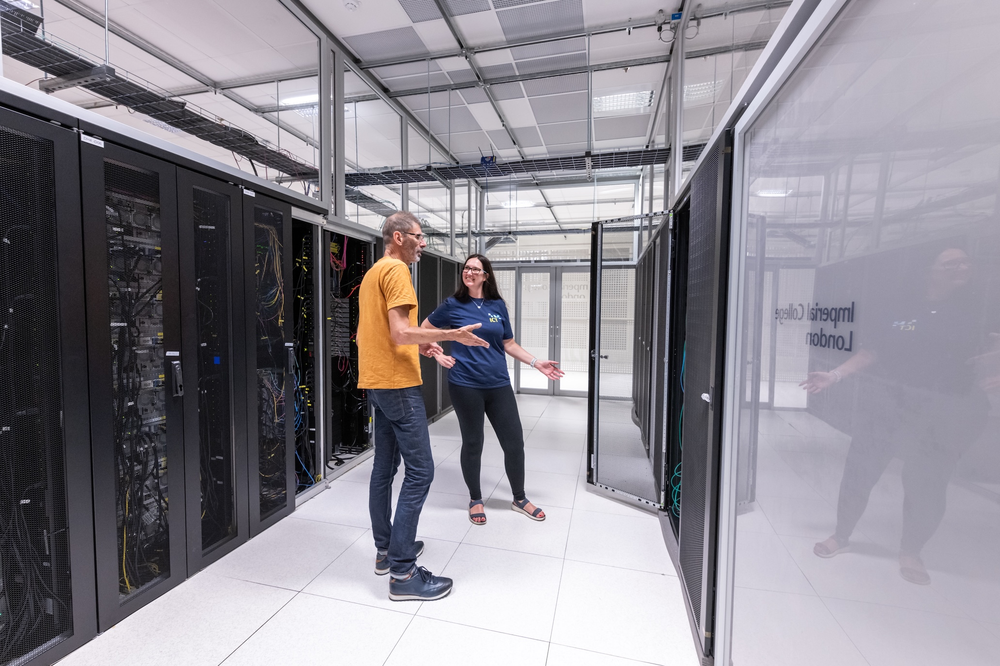
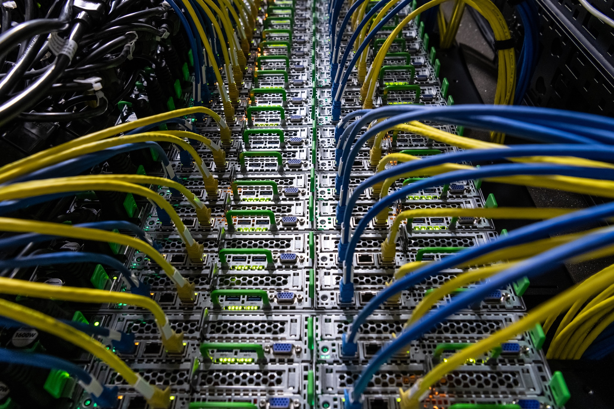
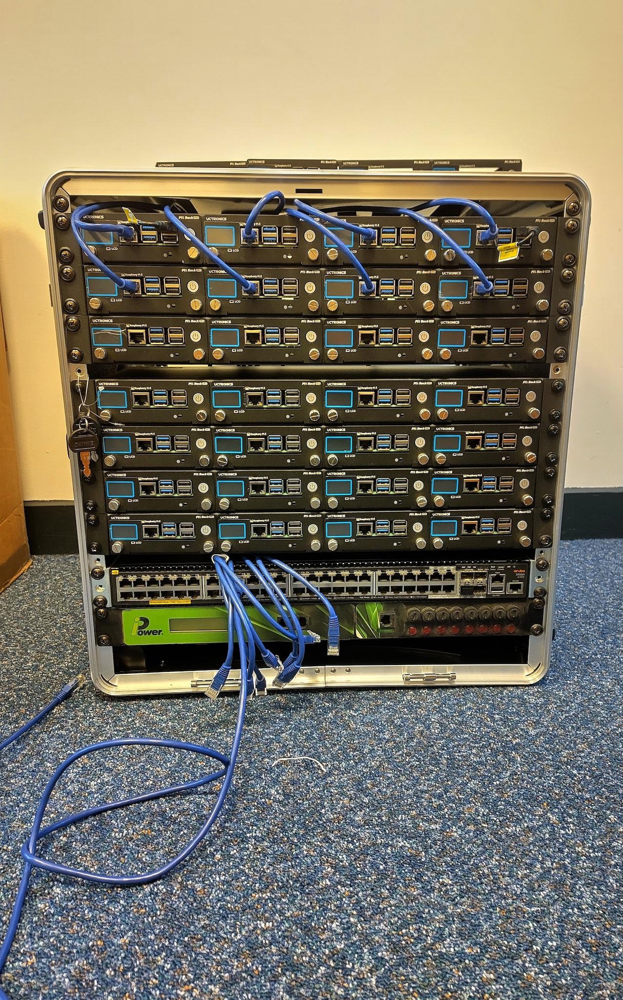

:::::::::::::::::::::::::::::::::::::: questions 

- How does a basic HPC cluster work?
- What does an HPC cluster look like?

::::::::::::::::::::::::::::::::::::::::::::::::

::::::::::::::::::::::::::::::::::::: objectives

- List the components of a basic HPC system.

::::::::::::::::::::::::::::::::::::::::::::::::

## HPC clusters 101

The previous episode already established that HPC clusters are made up of computers, which we call nodes, which are connected through a, typically high-speed, network.
Let's now dig into the different components of an HPC cluster and see how they work together.
HPC clusters will generally require the following basic components:

- nodes. There are different types of with specialised uses:
  - interactive (or login) nodes are used to access the cluster
  - compute node are used to run jobs. There are numerous compute nodes in a cluster.
  - storage, where files are stored. The nodes used for storage may have more RAM than the compute nodes.
- a switch, which connects the login, compute, and storage nodes to allow them to act as a seamless unit. These are usually InfiniBand or other high-speed Ethernet to meet the low-latency, high-bandwidth requirements of HPC clusters.

<!-- is this stupid xD -->
- cables connecting the different nodes

](files/clusters.png)

The components listed until now are all hardware.
A very important piece of software when working on an HPC cluster is the _job scheduler_.
A job scheduler is essential because the resources of an HPC cluster are finite and the demand on those resources is usually very high.
When submitting a job, users have to specify how many resources (RAM and GPUs) they require and how long they expect their job to take.
The scheduler uses this information to prioritise jobs and make as efficient use of the resources as possible.
One of the most commonly used job schedulers is Slurm.
There will be more information on Slurm in the following episode.

## Different types of HPC

<!-- if only embarassingly parallel, rethink how sections work -->

We've talked about the different hardware components of an HPC cluster that determine the system's computing power, bandwidth and memory storage.
These can be configured in bespoke ways to suit the type of problem at hand.
For example, some problems require a lot of storage space but little CPU, while others may require the opposite.

### Embarassingly parallel

Some scientific problems require running the same programme multiple times, but with different parameters.
Each run of the programme is completely independent from the rest, i.e. its run does not rely on the outcome of any other run.
In this case, all runs can happen in parallel on separate CPUs and everything is combined at the very end.
This would be an example of an "embarassingly parallel" task.

This relates to the concept of *high-throughput computing*, which not only runs multiple jobs in parallel and independently, but does so on *ordinary computers*.
This means that the nodes used in these systems are not specialised, but very similar to what you would use in your own laptop.

For embarassingly parallel tasks, priority is on a large number of CPUs, with a high-speed low-latency interconnect being less important.

<!--
### Shared memory parallelism

A different kind of scientific question might rely on the analysis of very large datasets.
Here, CPUs are able to work on tasks independently, but they all need access to the same dataset.

For this kind of tasks, all CPUs need to be part of the same node and have access to the same RAM.
-->
### Message Parsing Interface (MPI) parallelism

Sometimes, jobs can be parallelised to an extent but cannot be run completely independently of each other, but need to exchange information.
Generally this is the case because the different chunks of the task that needs to be completed can only be in a certain order.

In those cases, a high-speed low-latency interconnect is much more important compared to an embarassingly parallel task.

<!--
    constraints: memory, processors, discs. how do platforms differ? different kinds of HPC task require different resources (e.g. a lot of memory but little CPU vs lots of bandwidth)
    lots of computers that are similar to what your laptop but specialised
    specialist hardware matters because there are different types of computation which can rely heavily on the connection between the nodes. this gets us to high throughput vs high performance.
-->

::::::::::::::::::::::::::::::::::::: challenge 

## Will it embarassingly parallel

<!--     exercise: example problems and ask if it's embarassingly parallel. are we able to give people enough information? could also be a discussion in a small group. props? knitting metaphor or addition -->

:::::::::::::::::::::::: solution 

## Solution
 
```output
[1] "This new lesson looks good"
```

:::::::::::::::::::::::::::::::::

::::::::::::::::::::::::::::::::::::::::::::::::

## Visible HPC

A lot of the things we have been discussing can feel a bit abstract.
What does a node look like?
Where is a process happening?
How do these computers communicate to each other?


Below you can see some pictures from the Slough Data Centre hosting Imperial's High Performance Computing facilities.

<!--

Photographer
Dave Guttridge

-->

{alt='Image of two people standing next to large servers.'}
{alt='Image of a close up of the cluster nodes.'}

<!--

Importance of visible HPC - the importance of the thing being there
this is representative of the real world
-->

For better or worse, it is quite rare for researchers and research supporters to visit these facilities and get first-hand experience of what this equipment looks like.

That's where mini HPC clusters like ours come in!
They provide an opportunity for a wider audience to interact with this kind of infrastructure.

Here is a picture of our own mini cluster.

{alt='Image of a little cluster.'}

Clearly, these are very different beasts!
Our cluster is much smaller and, at least somewhat, portable.
However, the design of our cluster is realistic and can help build a visual connection to the real thing.
Let's look at how:

- the rack is 19 inches in width, which is the industry standard
- at only 12U, our cluster is rather short but stack four of them and you get a typical full size rack (48U)!

This is all about how our cluster _looks_, but let's not talk about what is inside it.
The workhorse of our cluster are 36 Raspberry Pi 5 computers.
Thirty-two of them are used as compute nodes, one as the interactive login node and three as a distributed memory system.
Raspberry Pi computers are a convenient choice for this mini cluster because they are easily available, relatively inexpensive and have a suite of compatible hardware and software, due to their popularity.
The Pis are powered over Ethernet cables, which again are easy to obtain.
In many HPC systems, the nodes will be more high powered than a Raspberry Pi and the interconnects will be more specialised than an Ethernet cable.
In that sense, this system is more closely related to the high-throughput computing type of HPC, not using any specialised equipment.

This is not true of our network switch which is enterprise-level and very similar to what you would see in a real data centre.


::::::::::::::::::::::::::::::::::::: challenge 

## Challenge 2: how do you nest solutions within challenge blocks?

:::::::::::::::::::::::: solution 

You can add a line with at least three colons and a `solution` tag.

:::::::::::::::::::::::::::::::::
::::::::::::::::::::::::::::::::::::::::::::::::


::::::::::::::::::::::::::::::::::::: keypoints 


::::::::::::::::::::::::::::::::::::::::::::::::

